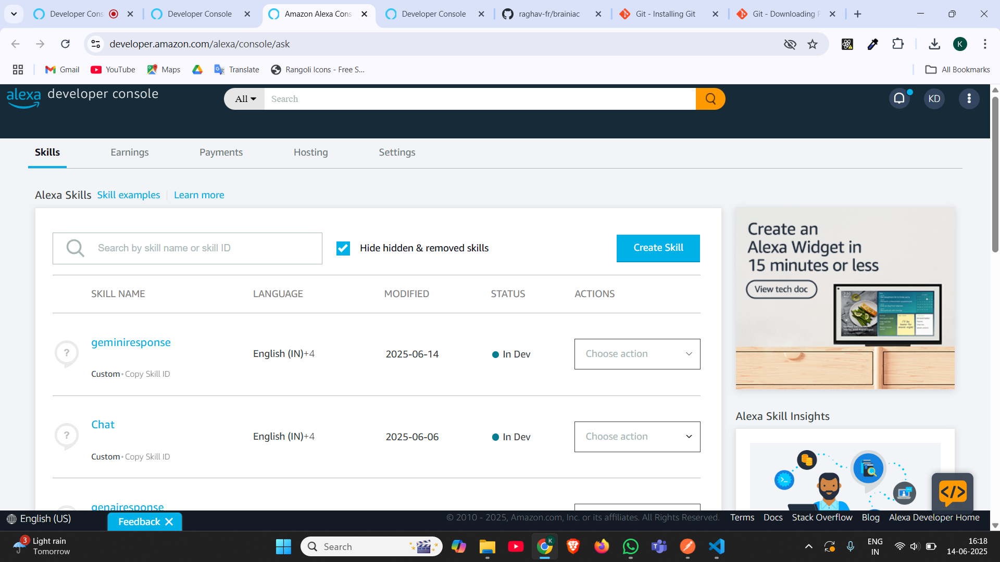
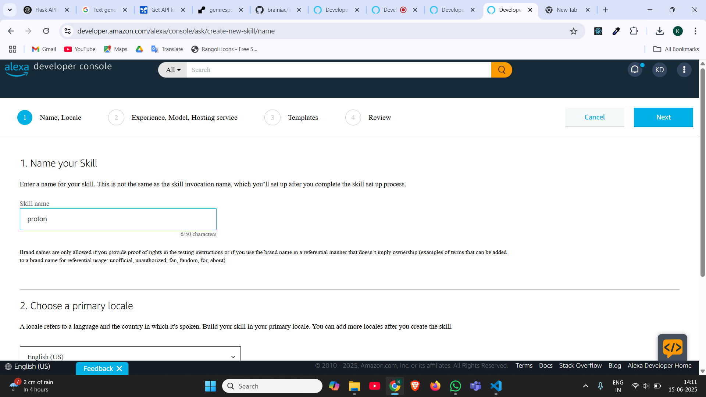
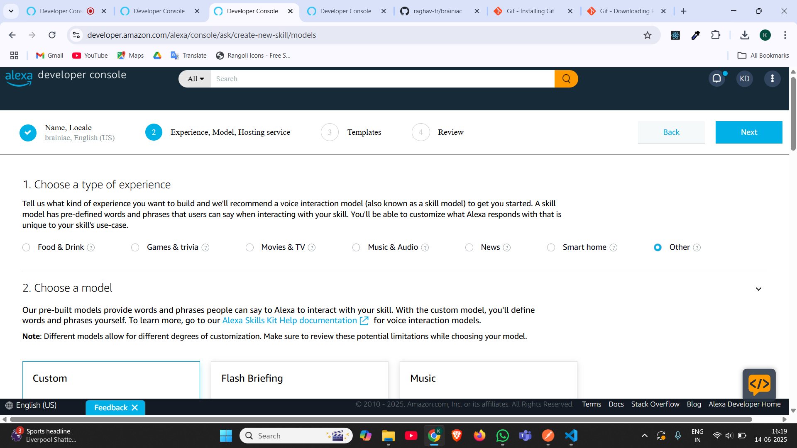
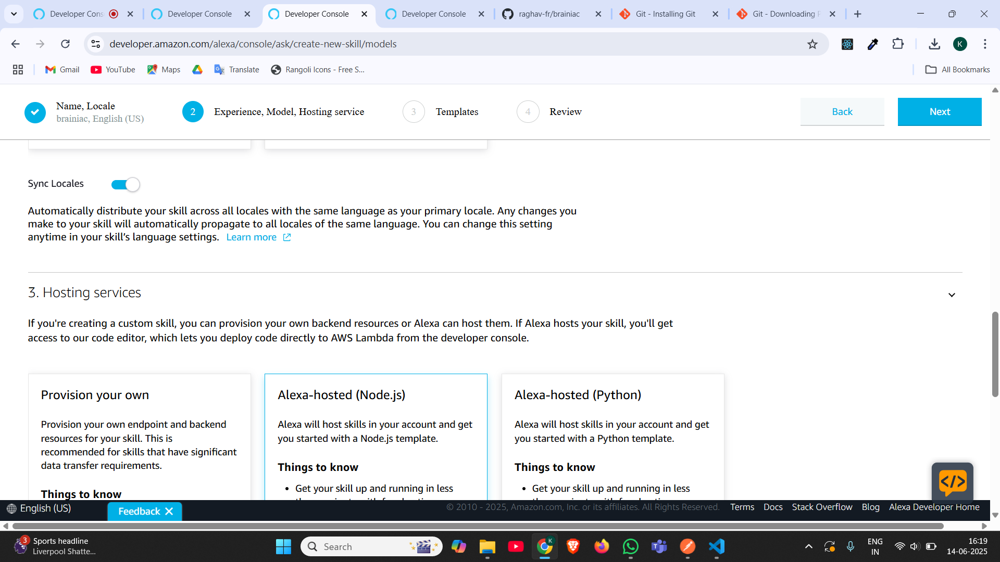
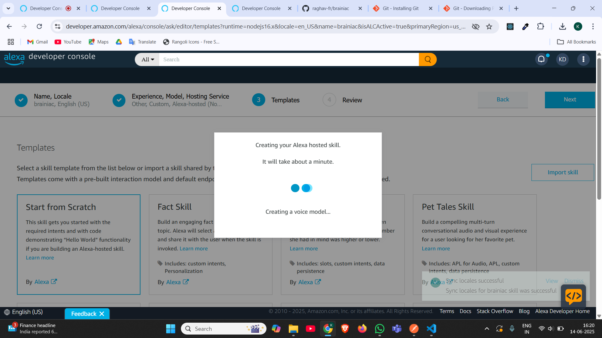
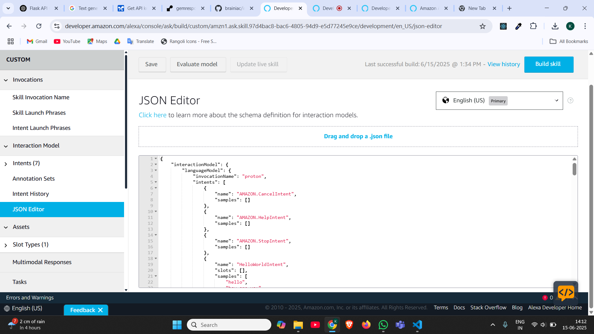
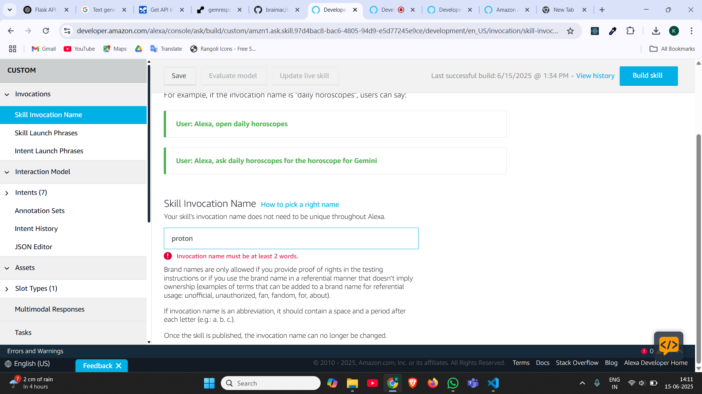

# 🧠 Proton – Alexa Skill

**proton** is a custom Alexa skill that enables users to interact with an intelligent AI assistant using voice commands. This guide walks you through the setup process using the Alexa Developer Console.

---

## 🚀 How to Set It Up

### 1. Log In

- Go to the [Alexa Developer Console](https://developer.amazon.com/alexa/console/ask).
- Log in using your Amazon Developer account.



---

### 2. Create a New Skill

- Click **"Create Skill"**.
- Enter the skill name: `proton`.
- Choose the **primary locale** (e.g., `en-US`).
  

- For the model, select:
  - **"Other" → "Custom"**
- For backend resources, select:
  - **"Alexa-hosted (Node.js)"**
    
    

---

### 3. Choose Setup Method

#### Option A – Import Skill

- Click **"Import Skill"**
- Paste the repository URL:
  ```
  https://github.com/raghav-fr/proton.git
  ```
- Click **"Import"**
  
  After importing this loader will open and let it finish.

#### Option B – Manual Setup

1. Choose **"Start from Scratch"** and click **"Create Skill"**.
2. Navigate to the **"Build"** section.
3. Open the **"JSON Editor"** tab.
4. Replace the existing JSON content with the provided JSON configuration.
   

```json
{
    "interactionModel": {
        "languageModel": {
            "invocationName": "proton",
            "intents": [
                {
                    "name": "AMAZON.CancelIntent",
                    "samples": []
                },
                {
                    "name": "AMAZON.HelpIntent",
                    "samples": []
                },
                {
                    "name": "AMAZON.StopIntent",
                    "samples": []
                },
                {
                    "name": "HelloWorldIntent",
                    "slots": [],
                    "samples": [
                        "hello",
                        "how are you",
                        "say hi world",
                        "say hi",
                        "hi",
                        "say hello world",
                        "say hello"
                    ]
                },
                {
                    "name": "AMAZON.NavigateHomeIntent",
                    "samples": []
                },
                {
                    "name": "AMAZON.FallbackIntent",
                    "samples": []
                },
                {
                    "name": "AskProtonIntent",
                    "slots": [
                        {
                            "name": "query",
                            "type": "AMAZON.SearchQuery"
                        }
                    ],
                    "samples": [
                        "were {query}",
                        "display {query}",
                        "show {query}",
                        "whose {query}",
                        "whom {query}",
                        "which {query}",
                        "help {query}",
                        "let {query}",
                        "Use {query}",
                        "In {query}",
                        "This {query}",
                        "You {query}",
                        "The {query}",
                        "Emphasised {query}",
                        "On {query}",
                        "Similarly {query}",
                        "Likewise {query}",
                        "However {query}",
                        "Yet {query}",
                        "Whereas {query}",
                        "While {query}",
                        "Despite {query}",
                        "Although {query}",
                        "Still {query}",
                        "Rather {query}",
                        "Instead {query}",
                        "Keeping {query}",
                        "Then {query}",
                        "Notwithstanding {query}",
                        "Nevertheless {query}",
                        "Contrary {query}",
                        "Conversely {query}",
                        "Given {query}",
                        "Here {query}",
                        "First {query}",
                        "Next {query}",
                        "Firstly {query}",
                        "Secondly {query}",
                        "Eventually {query}",
                        "Later {query}",
                        "Finally {query}",
                        "Also {query}",
                        "Furthermore {query}",
                        "Additionally {query}",
                        "Subsequently {query}",
                        "Moreover {query}",
                        "To {query}",
                        "More {query}",
                        "Just {query}",
                        "Equally {query}",
                        "Besides {query}",
                        "Another {query}",
                        "As {query}",
                        "So {query}",
                        "With {query}",
                        "Resulting {query}",
                        "It {query}",
                        "After {query}",
                        "Therefore {query}",
                        "Hence {query}",
                        "All {query}",
                        "For {query}",
                        "An {query}",
                        "Such {query}",
                        "Namely {query}",
                        "Consider {query}",
                        "Specifically {query}",
                        "Many {query}",
                        "Numerous {query}",
                        "A {query}",
                        "Most {query}",
                        "Majority {query}",
                        "Almost {query}",
                        "Commonly {query}",
                        "Usually {query}",
                        "Normally {query}",
                        "Few {query}",
                        "Some {query}",
                        "Not {query}",
                        "Rarely {query}",
                        "Only {query}",
                        "Scarcely {query}",
                        "Historically {query}",
                        "Initially {query}",
                        "Centuries {query}",
                        "Over {query}",
                        "Earlier {query}",
                        "Formerly {query}",
                        "Originally {query}",
                        "Conventionally {query}",
                        "Prior {query}",
                        "Until {query}",
                        "Recent {query}",
                        "Customarily {query}",
                        "According {query}",
                        "Based {query}",
                        "Challenges {query}",
                        "Supports {query}",
                        "Due {query}",
                        "And {query}",
                        "Certainly {query}",
                        "Above {query}",
                        "Undoubtedly {query}",
                        "Surely {query}",
                        "Arguably {query}",
                        "Of {query}",
                        "Obviously {query}",
                        "What {query}",
                        "Thus {query}",
                        "Summary {query}",
                        "Put {query}",
                        "Conclusion {query}",
                        "Sum {query}",
                        "Short {query}",
                        "Overall {query}",
                        "Things {query}",
                        "Wrap {query}",
                        "Whole {query}",
                        "Putting {query}",
                        "Conclude {query}",
                        "Summarise {query}",
                        "Brief {query}",
                        "Summing {query}",
                        "Please {query}",
                        "Good {query}",
                        "Oh {query}",
                        "Yes {query}",
                        "Ok {query}",
                        "Can {query}",
                        "Proton {query}",
                        "Want {query}",
                        "Details {query}",
                        "Detail {query}",
                        "Fetch {query}",
                        "Get {query}",
                        "Talk {query}",
                        "Tell {query}",
                        "Start {query}",
                        "Play {query}",
                        "There {query}",
                        "They {query}",
                        "We {query}",
                        "I {query}",
                        "Ask proton to {query}",
                        "Hey proton {query}",
                        "Why {query}",
                        "Can you tell proton {query}",
                        "Get from proton {query}",
                        "Tell proton {query}",
                        "Ask proton {query}",
                        "Explain {query}",
                        "Ask {query}",
                        "Where {query}",
                        "When {query}",
                        "Who {query}",
                        "How {query}",
                        "what {query}"
                    ]
                }
            ],
            "types": []
        }
    }
}
```

5. Change the `"invocationName"` to `"proton"` or any custom name you'd like to use to activate the skill.
   

---

### 4. Build the Model

- Click **"Save Model"**
- Then click **"Build Model"**

---

### 5. Add Code

- Go to the **"Code"** tab.

#### 🔧 Update `package.json`

Replace its content with:

```json
{
  "name": "hello-world",
  "version": "1.2.0",
  "description": "alexa utility for quickly building skills",
  "main": "index.js",
  "scripts": {
    "test": "echo \"Error: no test specified\" && exit 1"
  },
  "author": "Amazon Alexa",
  "license": "Apache License",
  "dependencies": {
    "ask-sdk-core": "^2.7.0",
    "ask-sdk-model": "^1.19.0",
    "aws-sdk": "^2.326.0",
    "axios": "^1.6.8"
  }
}
```

#### 🧠 Replace `index.js`

Replace the `index.js` content with your Alexa skill logic. Here's a basic template:

```js
const Alexa = require('ask-sdk-core');
const axios = require('axios');

const API_URL = 'https://gemresponse.onrender.com/gemini';

const AskProtonIntentHandler = {
    canHandle(handlerInput) {
        return Alexa.getRequestType(handlerInput.requestEnvelope) === 'IntentRequest' &&
            Alexa.getIntentName(handlerInput.requestEnvelope) === 'AskProtonIntent';
    },
    async handle(handlerInput) {
        const userId = handlerInput.requestEnvelope.session.user.userId;
        const query = Alexa.getSlotValue(handlerInput.requestEnvelope, 'query');

        try {
            const response = await axios.post(API_URL, {
                user_id: userId,
                query: query
            });

            const reply = response.data.response || "I couldn't understand your question.";

            return handlerInput.responseBuilder
                .speak(reply)
                .reprompt("You can ask me another question.")
                .getResponse();

        } catch (error) {
            console.error('Error from API:', error.message);
            return handlerInput.responseBuilder
                .speak("Sorry, I had trouble getting a response from Gemini.")
                .getResponse();
        }
    }
};

const LaunchRequestHandler = {
    canHandle(handlerInput) {
        return Alexa.getRequestType(handlerInput.requestEnvelope) === 'LaunchRequest';
    },
    handle(handlerInput) {
        const speakOutput = 'Welcome to Proton. Ask me anything!';

        return handlerInput.responseBuilder
            .speak(speakOutput)
            .reprompt('You can ask me anything, like "What is AI?"')
            .getResponse();
    }
};

// (Your existing handlers below remain unchanged)
const HelloWorldIntentHandler = {
    canHandle(handlerInput) {
        return Alexa.getRequestType(handlerInput.requestEnvelope) === 'IntentRequest'
            && Alexa.getIntentName(handlerInput.requestEnvelope) === 'HelloWorldIntent';
    },
    handle(handlerInput) {
        const speakOutput = 'Hello World!';
        return handlerInput.responseBuilder
            .speak(speakOutput)
            .getResponse();
    }
};

const HelpIntentHandler = {
    canHandle(handlerInput) {
        return Alexa.getRequestType(handlerInput.requestEnvelope) === 'IntentRequest'
            && Alexa.getIntentName(handlerInput.requestEnvelope) === 'AMAZON.HelpIntent';
    },
    handle(handlerInput) {
        const speakOutput = 'You can ask me anything. Try saying, "What is quantum computing?"';

        return handlerInput.responseBuilder
            .speak(speakOutput)
            .reprompt(speakOutput)
            .getResponse();
    }
};

const CancelAndStopIntentHandler = {
    canHandle(handlerInput) {
        return Alexa.getRequestType(handlerInput.requestEnvelope) === 'IntentRequest'
            && (Alexa.getIntentName(handlerInput.requestEnvelope) === 'AMAZON.CancelIntent'
                || Alexa.getIntentName(handlerInput.requestEnvelope) === 'AMAZON.StopIntent');
    },
    handle(handlerInput) {
        const speakOutput = 'Goodbye!';
        return handlerInput.responseBuilder
            .speak(speakOutput)
            .getResponse();
    }
};

const FallbackIntentHandler = {
    canHandle(handlerInput) {
        return Alexa.getRequestType(handlerInput.requestEnvelope) === 'IntentRequest'
            && Alexa.getIntentName(handlerInput.requestEnvelope) === 'AMAZON.FallbackIntent';
    },
    handle(handlerInput) {
        const speakOutput = 'Sorry, I didn\'t get that. You can try asking me something else.';

        return handlerInput.responseBuilder
            .speak(speakOutput)
            .reprompt('Try asking a question.')
            .getResponse();
    }
};

const SessionEndedRequestHandler = {
    canHandle(handlerInput) {
        return Alexa.getRequestType(handlerInput.requestEnvelope) === 'SessionEndedRequest';
    },
    handle(handlerInput) {
        console.log(`~~~~ Session ended: ${JSON.stringify(handlerInput.requestEnvelope)}`);
        return handlerInput.responseBuilder.getResponse();
    }
};

const IntentReflectorHandler = {
    canHandle(handlerInput) {
        return Alexa.getRequestType(handlerInput.requestEnvelope) === 'IntentRequest';
    },
    handle(handlerInput) {
        const intentName = Alexa.getIntentName(handlerInput.requestEnvelope);
        const speakOutput = `You just triggered ${intentName}`;

        return handlerInput.responseBuilder
            .speak(speakOutput)
            .getResponse();
    }
};

const ErrorHandler = {
    canHandle() {
        return true;
    },
    handle(handlerInput, error) {
        const speakOutput = 'Sorry, something went wrong. Please try again.';
        console.log(`~~~~ Error handled: ${JSON.stringify(error)}`);

        return handlerInput.responseBuilder
            .speak(speakOutput)
            .reprompt(speakOutput)
            .getResponse();
    }
};

// Add AskGeminiIntentHandler to the request chain
exports.handler = Alexa.SkillBuilders.custom()
    .addRequestHandlers(
        LaunchRequestHandler,
        AskProtonIntentHandler,
        HelloWorldIntentHandler,
        HelpIntentHandler,
        CancelAndStopIntentHandler,
        FallbackIntentHandler,
        SessionEndedRequestHandler,
        IntentReflectorHandler
    )
    .addErrorHandlers(ErrorHandler)
    .withCustomUserAgent('sample/hello-world/v1.2')
    .lambda();

```

---

### 6. Save and Deploy

- Click **"Save"**
- Click **"Deploy"**

---

### 7. Test the Skill

- Go to the **"Test"** tab.
- Enable **"Skill testing in development"**.
- Test by saying:

```
Alexa, open proton
```

---

## 📱 How to Set Up the Alexa App on Android for the Skill

To interact with your custom Brainiac Alexa skill using your Android device, follow these steps:

1. **Install the Alexa App**

   - Download and install the [Amazon Alexa app](https://play.google.com/store/apps/details?id=com.amazon.dee.app) from the Google Play Store.

2. **Log In with Your Amazon Account**

   - Use the same Amazon Developer account you used to create the skill.

3. **Enable Skill in app**

   - In the Alexa app, go to:
   **Home → getting started with alexa → Discover more → Your Skills**
   <p align="left">
   
   
   </p>
   - Navigate to **dev**

   <p align="left">
   
   </p>
   - Find your Skill -> click Enable skill
    <p align="left">
   
   </p>

4. **Use Your Skill**
   - After deploying your skill from the Alexa Developer Console, say:
     ```
     Alexa, open proton
     ```
   - You can now interact with the skill directly through your Android phone.

## 📞 Need Help?

- 📧 Open an issue on GitHub
- 💬 Ask questions in discussions
- ⭐️ Star the repo if you found it helpful!

---

## 🧪 Sample Invocation

```bash
open brainiac
```


---